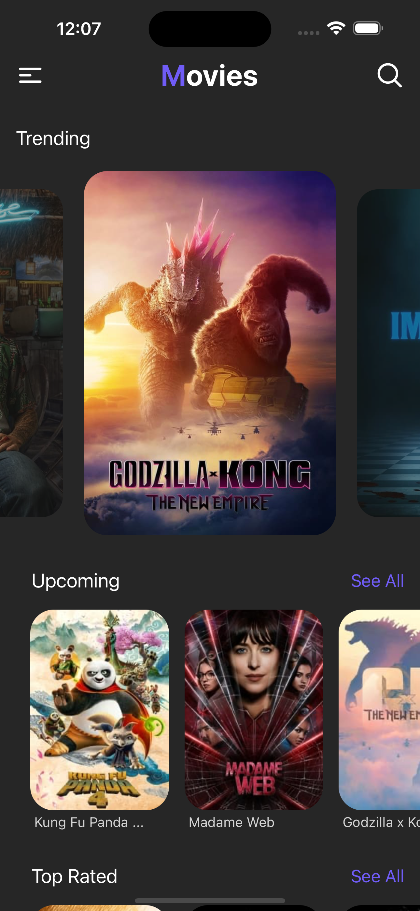
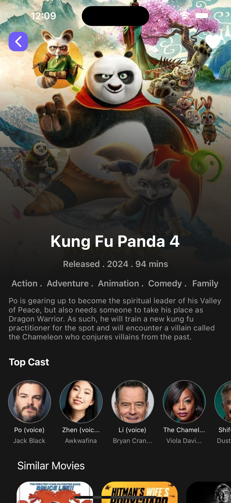
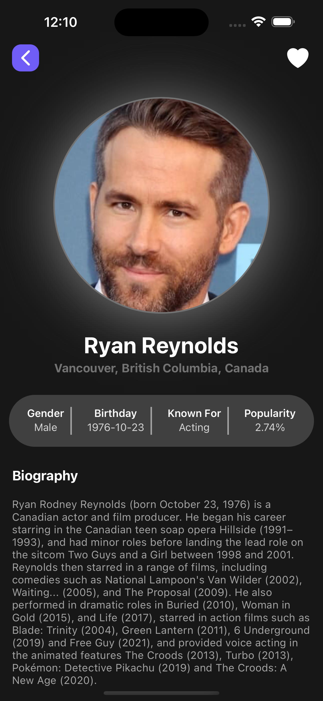

# Movie Explorer App

Movie Explorer is a React Native app that allows users to explore trending movies, upcoming movies, and find similar movies using data from The Movie Database (TMDb) API.

## Features

- View trending movies with details such as title, release date, and overview.
- Explore upcoming movies and their information.
- Search for movies similar to a selected movie.
- View detailed information about each movie, including ratings, genres, and cast members.
- Save favorite movies to a watchlist for later viewing.

## Screenshots





## Installation

1. Clone the repository:

   ```bash
   git clone https://github.com/PrinceLee1/movie_app.git
   ```

2. Navigate to the project directory:

   ```bash
   cd movie_app
   ```

3. Install dependencies:

   ```bash
   npm install
   # or
   yarn install
   ```

4. Create a `.env` file in the root directory and add your TMDb API key:

   ```plaintext
   MOVIE_DB_API_KEY=your_tmdb_api_key_here
   ```

5. Start the Metro bundler:

   ```bash
   npm start
   # or
   yarn start
   ```

6. Run the app on Android or iOS using Expo CLI:

   ```bash
   npm run android
   # or
   npm run ios
   ```

## Configuration

You need to obtain an API key from The Movie Database (TMDb) website to access their API. Visit [https://www.themoviedb.org/documentation/api](https://www.themoviedb.org/documentation/api) to get your API key.

## Technologies Used

- React Native
- Expo
- Axios (for API requests)
- React Navigation (for navigation)
- Redux (for state management)

## Contributing

Contributions are welcome! If you'd like to contribute to this project, please follow these steps:

1. Fork the repository.
2. Create a new branch (`git checkout -b feature/new-feature`).
3. Make your changes.
4. Commit your changes (`git commit -am 'Add new feature'`).
5. Push to the branch (`git push origin feature/new-feature`).
6. Create a new Pull Request.

## License

This project is licensed under the MIT License - see the [LICENSE](LICENSE) file for details.
